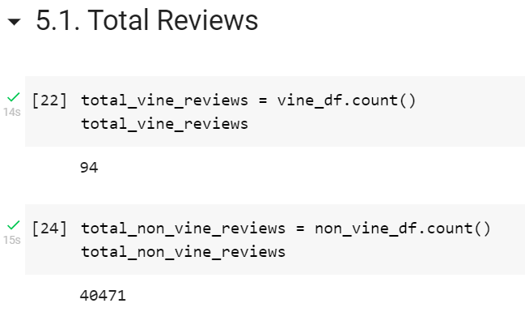
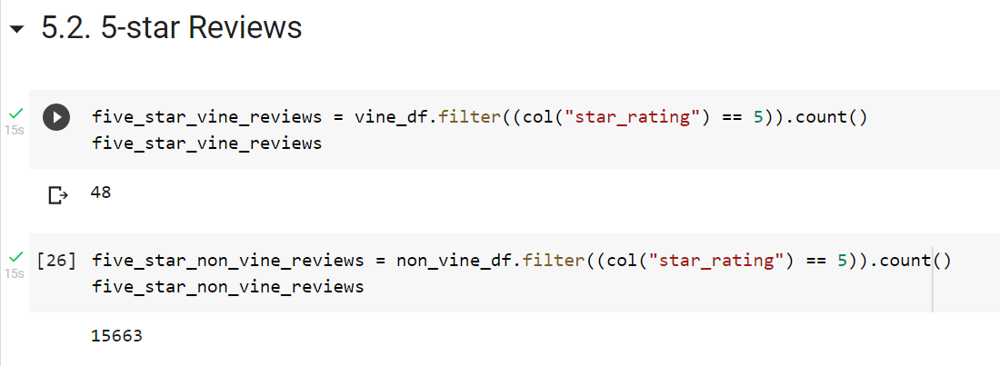
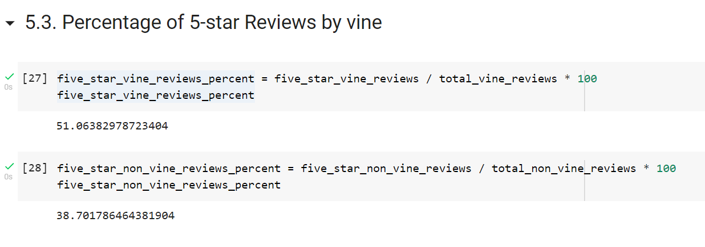

# Amazon_Vine_Analysis

## Analysis Overview
This project analyzes Amazon Vine program and determines if there is a bias toward favorable reviews from Vine members.\
The analysis uses PySpark to perform the ETL process to extract the dataset, transform the data, connect to an AWS RDS instance, load the transformed data into pgAdmin and calculate different metrics.\
We focused on the US reviews for video games.

## Resources
- Data Source: [Amazon Review datasets](https://s3.amazonaws.com/amazon-reviews-pds/tsv/index.txt), [Video Games Review dataset](https://s3.amazonaws.com/amazon-reviews-pds/tsv/amazon_reviews_us_Video_Games_v1_00.tsv.gz)
- Software: Google Colab Notebook, PostgreSQL 11.9, pgAdmin 4, AWS

## Results
### Total number of reviews

### Total number of 5-star reviews

### Percentage of 5-star reviews

## Summary
About 51% of the reviews in the Vine program were 5 stars reviews whereas only 39% of the non-Vine reviews were 5-star. This indicates a bias for reviews in the Vine program to be 5-star.\
Additionally:
* we could analyse the statistical distribution (mean, median and mode) of the star rating for the reviews based on vine status.
* we could also identify product categories that are susceptible to bias based on vine status.
* we could perform natural lanugage processing on the review body to separate genuine 5-star paid reviews from superficial ones.
